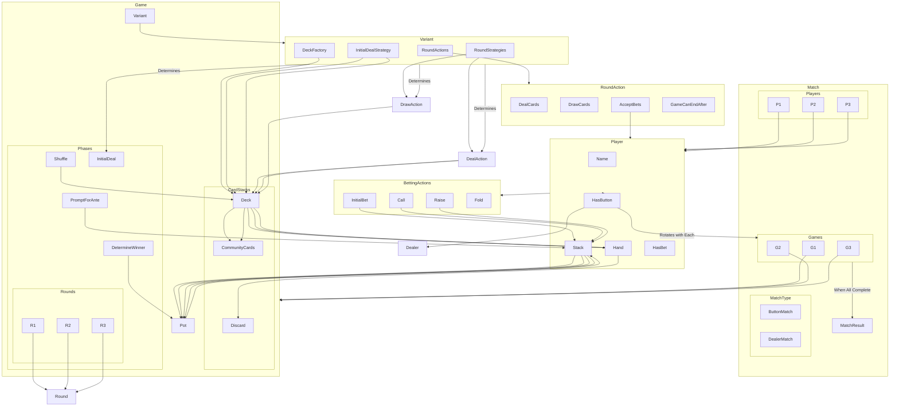

# MATCH FLOWCHART

```mermaid
flowchart TD
    subgraph Match
        subgraph MatchType
            ButtonMatch
            DealerMatch
        end
        subgraph Players
            P1
            P2
            P3
        end
        subgraph Games
            G1
            G2
            G3
        end
        MatchResult
    end
    subgraph Game
        SelectedVariant[Variant]
        Pot
        subgraph CardStacks
            Deck
            CommunityCards
            Discard
        end
        subgraph Phases
            Shuffle
            PromptForAnte
            InitialDeal
            subgraph Rounds
                R1
                R2
                R3
            end
            DetermineWinner
        end
    end
    subgraph Variant
        subgraph RoundActions
        end
        DeckFactory
        InitialDealStrategy
        RoundStrategies
    end
    subgraph RoundAction
        DealCards
        DrawCards
        AcceptBets
        GameCanEndAfter
    end
    subgraph Player
        Name
        Stack
        Hand
        HasButton
        HasBet
    end
    subgraph BettingActions
        InitialBet
        Call
        Raise
        Fold
    end
    G1 --> Game
    G2 --> Game
    G3 --> Game
    P1 --> Player
    P2 --> Player
    P3 --> Player
    Player --> HasButton --> Dealer
    HasButton -->|Rotates with Each| Games
    R1 --> Round
    R2 --> Round
    R3 --> Round
    SelectedVariant --> Variant
    RoundActions --> RoundAction
    Variant -->|Determines| InitialDeal
    Variant -->|Determines| DealAction
    Variant -->|Determines| DrawAction
    DeckFactory --> Deck
    Shuffle --> Deck
    InitialDealStrategy --> Deck --> Hand
    InitialDealStrategy --> Deck --> CommunityCards
    PromptForAnte --> Stack --> Pot
    RoundStrategies --> DealAction
    RoundStrategies --> DrawAction
    DealAction --> Deck --> Hand
    DealAction --> Deck --> CommunityCards
    DrawAction --> Deck --> Hand --> Discard
    DetermineWinner --> Pot --> Stack
    AcceptBets --> Player --> BettingActions
    InitialBet --> Stack --> Pot
    Call --> Stack --> Pot
    Raise --> Stack --> Pot
    Games -->|When All Complete| MatchResult
```