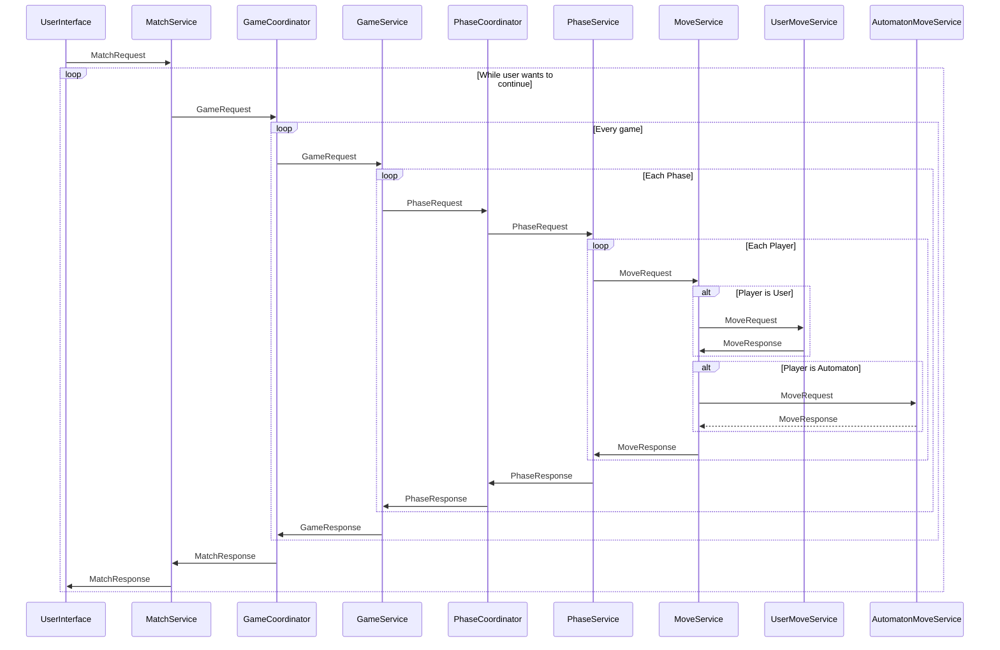

# MATCH SEQUENCE DIAGRAM

```mermaid
sequenceDiagram
    
    participant UserInterface
    participant MatchService
    participant GameCoordinator
    participant GameService
    participant PhaseCoordinator
    participant PhaseService
    participant MoveService
    participant UserMoveService
    participant AutomatonMoveService
    
    UserInterface->>MatchService : MatchRequest
    
    loop While user wants to continue

        MatchService->>GameCoordinator : GameRequest

        loop Every game

            GameCoordinator->>GameService : GameRequest

            loop Each Phase

                GameService->>PhaseCoordinator : PhaseRequest
                PhaseCoordinator->>PhaseService : PhaseRequest

                loop Each Player
                    PhaseService->>MoveService : MoveRequest
                    alt Player is User
                        MoveService->>UserMoveService : MoveRequest
                        UserMoveService->>MoveService : MoveResponse
                    end
                    alt Player is Automaton
                        MoveService->>AutomatonMoveService : MoveRequest
                        AutomatonMoveService-->>MoveService : MoveResponse
                    end
                    MoveService->>PhaseService : MoveResponse
                end

                PhaseService->>PhaseCoordinator : PhaseResponse
                PhaseCoordinator->>GameService : PhaseResponse

            end

            GameService->>GameCoordinator : GameResponse
        end

        GameCoordinator->>MatchService : MatchResponse
        MatchService->>UserInterface : MatchResponse    
    
    end
```

